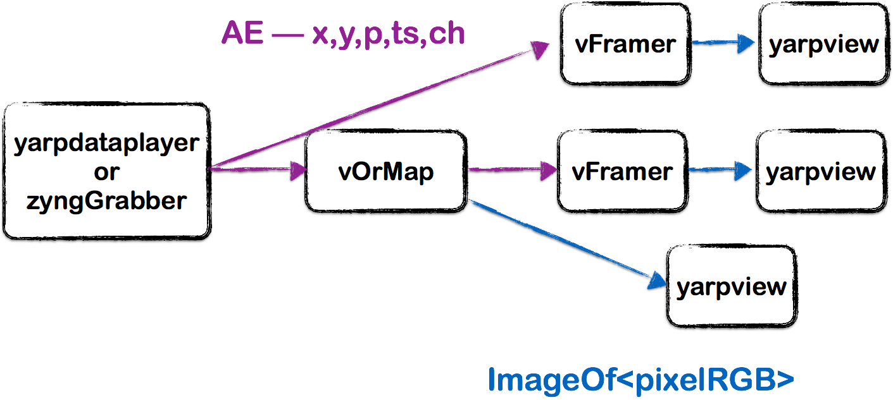
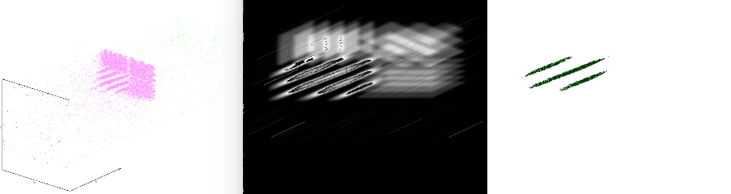

Event-driven orientation filter
=============================

Create an event-driven spiking feature map based on oriented filters

# Prerequisites
By now, you should have learnt to create a map of spiking neurons, ([Spiking Model](https://github.com/vvv-school/solution_event-spiking-model) assignment).

# Assignment
You have to modify the map such that each neuron has a spatial receptive field, i.e. the neuron energy increases (or decreases) for events from a local neighbourhood centred around the (x,y) position of the neuron in the map. The receptive field shall be designed in a way to make the neuron selective to a given orientation of the input stimulus.

To accomplish this task you have to modify the code developed in the [previous assignment](https://github.com/vvv-school/solution_event-spiking-model) **filling in the missing gaps** highlighted by the comment `// FILL IN THE CODE`, to:

1. Create a parametrised filter selective to a given orientation.
1. Modify the update function of the neuron to use the filter.

You should be able to visualise the subthreshold activity map of the neurons as an image stream in yarpview and the output events from the map by using `vFramer`, running the _yarpmanager script_ provided from within [**app/scripts**](./app/scripts/).

The application will look like this:

You will run this assignment with the [_Dataset_event-orientation-filter_]() dataset. The dataset has bars at different orientations, each map will be selective to only one orientation and should show spiking activity only where the orientation of the stimulus matches the orientation of the filter. Hint: The angles of the stimulus are: 0, 60, 90 and 120 degrees.

Once done, you can test your code **Automatically**: [running the script **test.sh**](https://github.com/vvv-school/vvv-school.github.io/blob/master/instructions/how-to-run-smoke-tests.md) in the **smoke-test** directory. An example of the response you should receive to pass the assignment for a 60 degree oriented filter is:

#Note:
- The input parameter, theta,  will be set by the smoke_test and must be adjustable on the command line.
- You may have to tune Te and Tau for the second dataset, by setting the default values.
- The filter must have a positive region, where the input events increase the energy, and a negative (or zero) region on the sides where the input events decrease the energy.
- You can choose different options to design the filter. A possible solution is to use the equation of a line (you may need to adjust the thickness), or, if you feel more adventurous, use the [2D Gabor filter](https://en.wikipedia.org/wiki/Gabor_filter)

# [How to complete the assignment](https://github.com/vvv-school/vvv-school.github.io/blob/master/instructions/how-to-complete-assignments.md)
